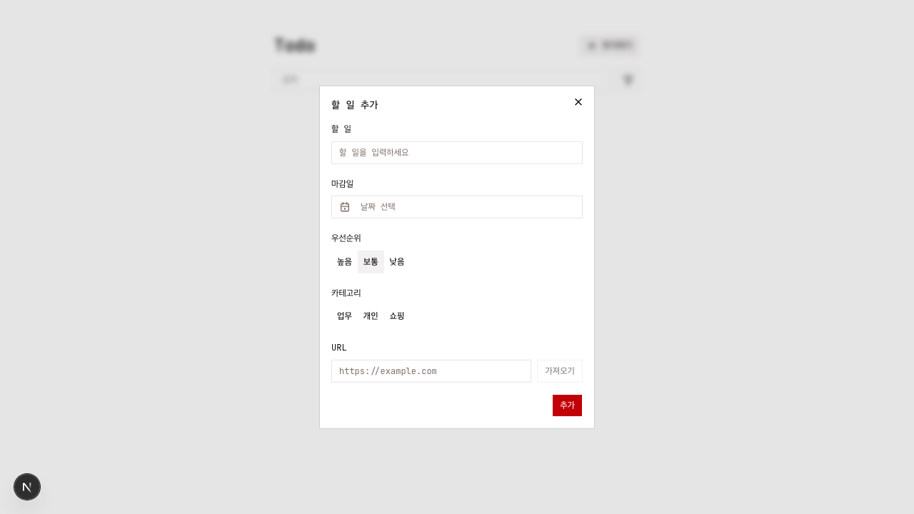
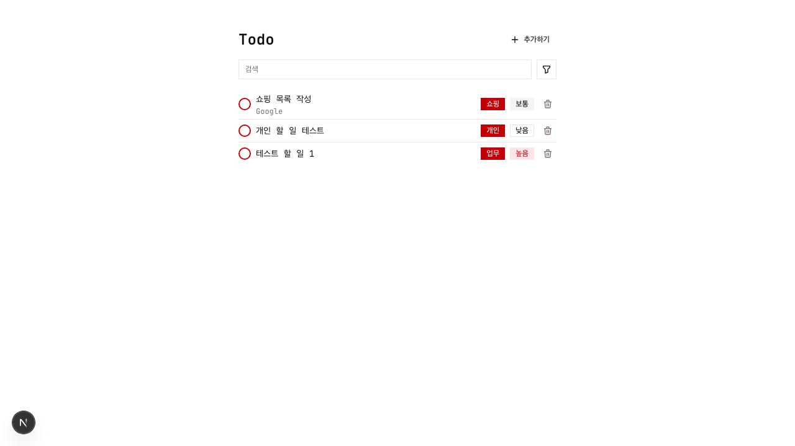
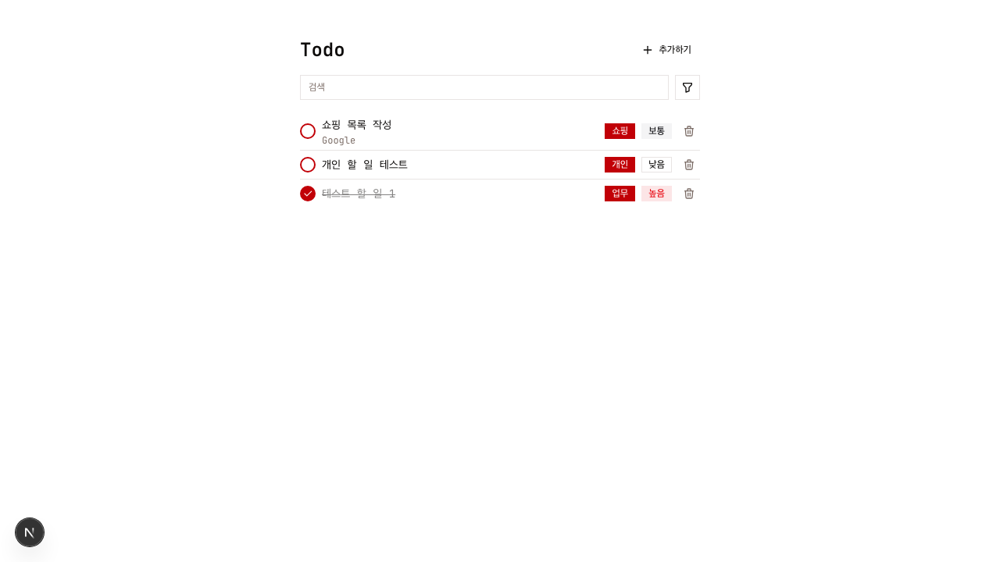
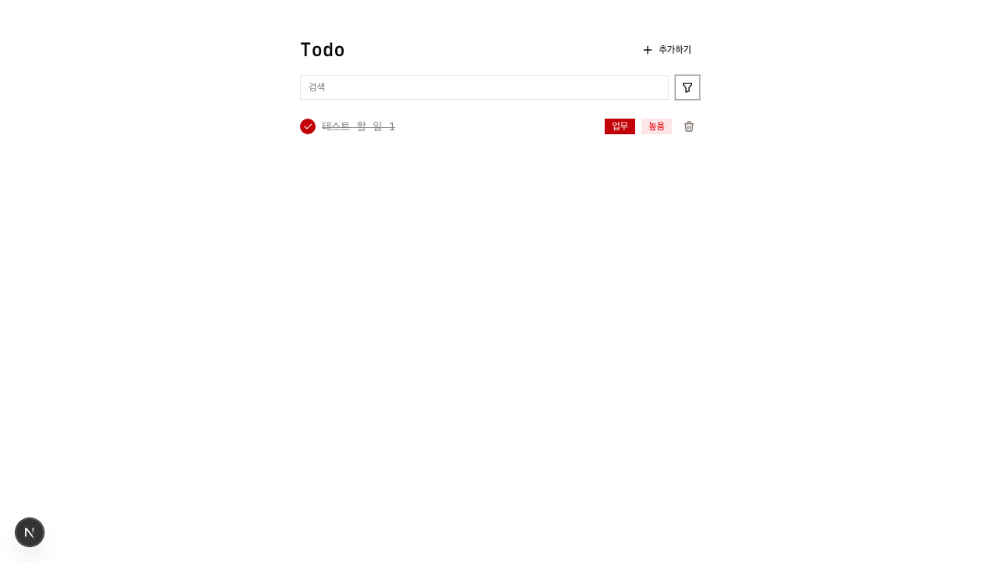
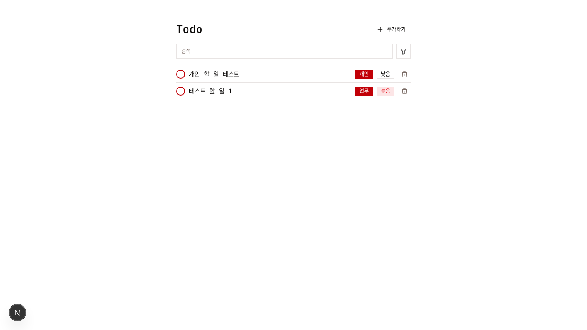
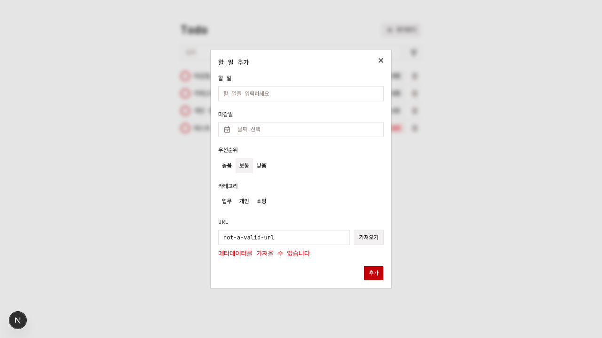

# Dogfood Report: Todo App (localhost:3000)

| Field | Value |
|-------|-------|
| **Date** | 2026-03-18 |
| **App URL** | http://localhost:3000 |
| **Session** | localhost-3000 |
| **Scope** | Full app |

## Summary

| Severity | Count |
|----------|-------|
| Critical | 0 |
| High | 1 |
| Medium | 3 |
| Low | 2 |
| **Total** | **6** |

## Issues

### ISSUE-001: 빈 폼 제출 시 유효성 검사 피드백 없음

| Field | Value |
|-------|-------|
| **Severity** | medium |
| **Category** | ux |
| **URL** | http://localhost:3000 |
| **Repro Video** | N/A |

**Description**

"할 일 추가" 다이얼로그에서 아무 내용도 입력하지 않고 "추가" 버튼을 클릭하면, Todo가 생성되지는 않지만 사용자에게 어떤 유효성 검사 메시지도 표시되지 않는다. 어떤 필드가 필수인지 알 수 없어 사용자 혼란을 유발할 수 있다.

**Repro Steps**

1. "추가하기" 버튼을 클릭하여 다이얼로그를 연다
2. 아무 필드도 입력하지 않고 "추가" 버튼 클릭
3. **관찰:** 다이얼로그가 유지되지만 에러 메시지나 필수 필드 표시가 없음
   

---

### ISSUE-002: 필터 전환 시 Todo 완료 상태가 초기화됨

| Field | Value |
|-------|-------|
| **Severity** | high |
| **Category** | functional |
| **URL** | http://localhost:3000 |
| **Repro Video** | videos/issue-002-completed-state-lost.webm |

**Description**

Todo를 완료 처리(체크박스 클릭)한 후 필터 드롭다운에서 "완료" → "전체"로 전환하면, 완료 처리했던 Todo의 체크 상태가 해제된다. 사용자가 완료한 작업이 다시 미완료 상태로 돌아가는 심각한 버그이다.

**Repro Steps**

1. Todo 항목의 체크박스를 클릭하여 완료 처리
   

2. 체크박스가 체크되고 취소선이 표시됨을 확인
   

3. 필터 버튼을 클릭 → "완료" 선택 → 완료된 Todo가 정상 표시됨
   

4. 필터 버튼 클릭 → "전체" 선택
5. **관찰:** 이전에 완료 처리한 Todo의 체크박스가 해제되어 있음
   

---

### ISSUE-003: 삭제 시 확인 다이얼로그 없음

| Field | Value |
|-------|-------|
| **Severity** | medium |
| **Category** | ux |
| **URL** | http://localhost:3000 |
| **Repro Video** | N/A |

**Description**

삭제(휴지통) 버튼을 클릭하면 확인 없이 즉시 Todo가 삭제된다. 실수로 클릭할 경우 데이터를 복구할 수 없으므로, 삭제 확인 다이얼로그 또는 실행 취소(undo) 기능이 필요하다.

**Repro Steps**

1. Todo 목록에서 휴지통 아이콘을 클릭
2. **관찰:** 확인 없이 즉시 삭제됨
   

---

### ISSUE-004: 삭제 버튼에 aria-label 누락

| Field | Value |
|-------|-------|
| **Severity** | low |
| **Category** | accessibility |
| **URL** | http://localhost:3000 |
| **Repro Video** | N/A |

**Description**

각 Todo 항목의 삭제 버튼(휴지통 아이콘)에 `aria-label` 속성이 없다. 스크린 리더 사용자가 해당 버튼의 기능을 알 수 없다. "추가하기" 버튼과 "필터" 버튼에는 aria-label이 있지만, 삭제 버튼에는 없어 일관성이 없다.

**Repro Steps**

1. 페이지 접근성 트리를 확인
2. **관찰:** 삭제 버튼의 aria-label이 null로 표시됨

---

### ISSUE-005: DialogContent에 Description 누락 (콘솔 경고)

| Field | Value |
|-------|-------|
| **Severity** | low |
| **Category** | accessibility |
| **URL** | http://localhost:3000 |
| **Repro Video** | N/A |

**Description**

"할 일 추가" 다이얼로그를 열 때마다 콘솔에 `Warning: Missing Description or aria-describedby={undefined} for {DialogContent}` 경고가 반복적으로 출력된다. Dialog 컴포넌트에 `DialogDescription`을 추가하거나 `aria-describedby`를 설정해야 한다.

**Repro Steps**

1. 브라우저 콘솔을 열고 "추가하기" 버튼을 클릭
2. **관찰:** 콘솔에 DialogContent Description 경고가 출력됨

---

### ISSUE-006: 잘못된 URL 메타데이터 요청 시 500 Internal Server Error

| Field | Value |
|-------|-------|
| **Severity** | medium |
| **Category** | console |
| **URL** | http://localhost:3000 |
| **Repro Video** | N/A |

**Description**

유효하지 않은 URL(예: "not-a-valid-url")로 메타데이터 가져오기를 시도하면 서버가 500 Internal Server Error를 반환한다. UI에서는 "메타데이터를 가져올 수 없습니다" 에러 메시지가 표시되지만, 서버 측에서 500이 아닌 400 Bad Request로 응답해야 한다. 500 에러는 서버 장애 모니터링에서 불필요한 알람을 유발할 수 있다.

**Repro Steps**

1. "추가하기" 다이얼로그에서 URL 필드에 "not-a-valid-url" 입력
2. "가져오기" 버튼 클릭
3. **관찰:** 콘솔에 500 Internal Server Error 표시
   

---
